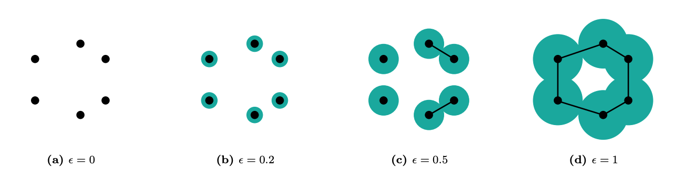
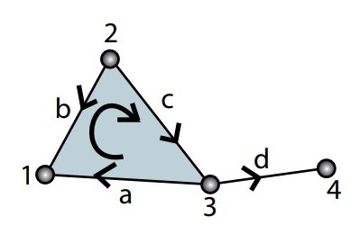
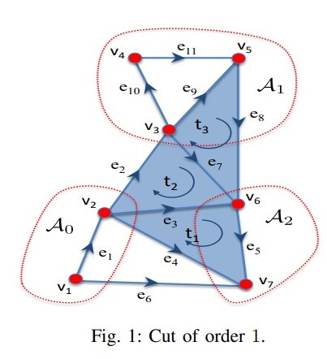
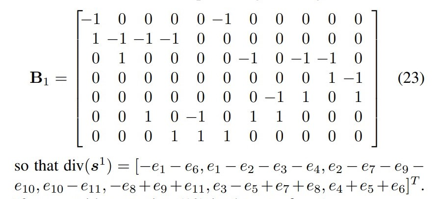

class: middle, center

```{r}
#| echo: false
#| eval: false
pagedown::chrome_print("index.html", output = "test.pdf")
```

# Procesamiento topológico de señales

<p style="margin-bottom: 20px;"> &nbsp; </p>

Expositor:&emsp;`Lucio Cornejo`

Fecha:&emsp;`07/12/2023`

---

# Tabla de contenidos

<p style="margin-bottom: 10px;"> &nbsp; </p>

`1)` Problemática principal

`2)` Contexto topológico

`3)` Contexto algebraico

`4)` Teoría espectral simplicial

`5)` Problemas de optimización

---

# Problemática principal

**¿Cómo extraer información de un network/grafo?**

- Representaciones vía **grafos** se limitan a 
**interacciones entre pares**.

.center[
  *`Solución:`*&emsp;Grafo $\Longrightarrow$  Hipergrafo
]

**¿Cómo extraer información de un hipergrafo?**

- No es evidente qué espacios topológicos construidos
a partir de un hipergrafo son más eficientes en capturar
la información topológica (**de conexiones**) del hipergrafo.

---
class: middle

<p style="margin-bottom: 30px;"> &nbsp; </p>

.center[
  *`Solución:`*&emsp;Hipergrafo $\Longrightarrow$  Complejo simplicial
]

<p style="margin-bottom: 30px;"> &nbsp; </p>

Diferencia principal entre los objetivos de 
**Análisis Topológico de datos** (TDA) y 
**Procesamiento Topológico de señales** (TSP):
  - **TDA**: Analizar propiedades del **complejo simplicial**
  creado a partir de los datos.
  - **TSP**: Analizar propiedades de **señales** definidas
  sobre un complejo simplicial.

<p style="margin-bottom: 20px;"> &nbsp; </p>

---

Ejemplos de estructuras donde **TSP** puede aplicarse:

- Network respecto al flujo sanguíneo entre diferentes
partes del cerebro (*señal de arista*).

- Network de autores (vértices), donde aristas representan
la existencia de una publicación entre dos autores; y, 
triángulos llenados (**2-simplex**) representan la existencia
de una publicación entre los tres autores.

- Tráfico de datos conectados por links de comunicación.

---

# Contexto topológico

.math-tool[Definición:]&ensp; Un $\text{ k-simplex }$ ***geométrico*** es la cápsula convexa de un conjunto 
de $k+1$ puntos de $\mathbb{R}^n$ afínmente independientes.

.math-tool[Definición]&ensp; Dado un conjunto finito de $N$ 
puntos $\left\{ v_0, \dots, v_{N-1} \right\}$, un 
$\text{ k-simplex }$ ***orientado*** se define como
$\left[ v_{i_0}, \dots, v_{i_k} \right]$, donde $0\leq i_j \leq N-1$ 
para $j=0, \dots, k$, y, $v_{i_j} \neq v_{i_m}$ para cada 
$i_j \neq i_m$.

Se consideran solo dos posibles orientaciones para cada 
$\text{ k-simplex }$, en base a la equivalencia de orientaciones
si se pueden conectar vía un **número par de transposiciones**.

---

.math-tool[Definición:]&ensp; La dimensión de un $\text{ k-simplex }$ es uno menos que su cardinalidad. Así, un vértice es un simplex 
0-dimensional; una arista, un simplex 1-dimensional. 

.math-tool[Definición:]&ensp; Una  ***cara***
del $\text{ k-simplex } \left[ v_{i_0}, \dots, v_{i_k} \right]$
es un $(k-1)\text{-simplex }$ de la forma 
$\left[ v_{i_0}, \dots, v_{i_{j-1}}, v_{i_{j+1}},\dots, v_{i_k} \right]$, para algún $0\leq j \leq k$ .

.math-tool[Definición:]&ensp; Un ***complejo simplicial abstracto***
$X$ es una colección finita de símplices tal que, para cada 
simplex $\sigma\in X$, todas las caras de $\sigma$ están en $X$ .

La dimensión de un complejo simplicial abstrato es la **mayor dimensión** de sus símplices. 

---

En ese sentido, un grafo es un complejo simplicial abstracto
de dimensión/orden $1$ .

<p style="margin-bottom: 30px;"> &nbsp; </p>


.pull-left[

]

.pull-right[

]

---

.math-tool[Definición:]&ensp; Dos $\text{ k-símplices }$ 
de un mismo complejo simplicial $X$ 
se denominan ***adyacentes superiores*** si ambos son la
cara de algún $(k+1)\text{-simplex }$ en $X$ .

.math-tool[Definición:]&ensp; Dos $\text{ k-símplices }$ 
de un mismo complejo simplicial $X$ 
se denominan ***adyacentes inferiores*** si poseen una cara
común en $X$, de dimensión $k-1$.

.math-tool[Definicón:]&ensp; Una cara $\sigma_j^{k-1}$ de un
$\text{ k-simplex } \sigma_j^k$ se denomina una ***elemento frontera*** de $\sigma_j^k$. Aquello lo denotamos por
$\sigma_j^{k-1} \subset \sigma_j^k$ .

.math-tool[Definición:]&ensp; Dado $\sigma_j^{k-1} \subset \sigma_j^k$, denotamos $\sigma_j^{k-1} \sim \sigma_j^k$ si ambos
símplices poseen la misma orientación; $\sigma_j^{k-1} \not\sim \sigma_j^k$; caso contrario.

---

.math-tool[Definición:]&ensp; Dados $\sigma_1^k, \dots, \sigma_{n_k}^k$, símplices en $X$, una $\text{ k-cadena } \tau_k$ se define
como la combinación lineal $\displaystyle{ \sum_{i=1}^{n_k} \alpha_i \sigma_i^k}$ con coeficientes en $\mathbb{R}$.

.math-tool[Definición:]&ensp; $C_k \left( X, \mathbb{R}\right)$ denota el ***espacio vectorial*** formado por las $\text{ k-cadenas }$ de $X$ .

.math-tool[Definición:]&ensp; El ***operador frontera*** $\partial_k: C_k \left( X, \mathbb{R}\right) \rightarrow C_{k-1} \left( X, \mathbb{R}\right)$ se define como  
$\partial_k \left[ v_{i_0}, \dots, v_{i_k} \right] =$ 
$\displaystyle{ \sum_{j=0}^{k} (-1)^j \left[ v_{i_0}, \dots, v_{i_{j-1}}, v_{i_{j+1}}, \dots, v_{i_k} \right]}$ .

.math-tool[Proposición:] Para todo $k$ entero positivo, se cumple
$\partial_k \circ \partial_{k+1} \equiv 0\;.$ 

---

# Contexto algebraico

La estructura de un complejo simplicial $X$ de dimensión $K$ 
es completamente descrita por sus ***matrices de incidencia***
$B_1, \dots, B_k, \dots, B_K$ .

La matriz de incidencia $B_k$ es la representación matricial
del operador de frontera. Por lo tanto, se cumple

$$
B_k \left( i, j \right) =
  \begin{cases}
    0, & \text{ si }\quad 
      \sigma_i^{k-1} \not\subset \sigma_j^k \\\\
    1, & \text{ si }\quad
      \sigma_i^{k-1} \subset \sigma_j^k 
      \quad\text{ y }\quad \sigma_i^{k-1} \sim \sigma_j^k \\\\
    -1, & \text{ si }\quad
      \sigma_i^{k-1} \subset \sigma_j^k 
      \quad\text{ y }\quad \sigma_i^{k-1} \not\sim \sigma_j^k \\\\
  \end{cases}
$$

---

.math-tool[Propiedad:]&ensp; Debido a la propiedad fundamental
del operador frontera, se cumple $B_k B_{k+1} \equiv 0$.

.math-tool[Propiedad:]&ensp; La estrucutra de un $\text{ K-complejo simplicial }$ es completamente descrita por sus 
***matrices Laplacianas combinatorias***:

$L_0 = B_1 B_1^T$ 

$L_k = B_k^T B_k + B_{k+1}B_{k+1}^T,\quad k = 1, \dots, K-1$

$L_K = B_K^T B_K$ 

---

# Teoría espectral simplicial

En el estudio de grafos, los **autovectores** asociados
a los autovalores más pequeños de $L_0$ son muy útiles
para la [identificación de clusters](https://arxiv.org/abs/0711.0189).

Enfoquémonos en el caso de símplices de orden a lo más $2$, pese a que esta teoría es más general.

Dado un conjunto de vértices, $\mathcal{V}$; aristas, 
$\mathcal{E}$; y triángulos, $\mathcal{T}$, de cardinalidades 
respectivas $V, E$ y $T$, se tiene un complejo simplicial
asociado $X = \mathcal{X}\left( \mathcal{V}, \mathcal{E}, \mathcal{T} \right)$.

Las ***señales*** de orden $k$ sobre cada $\text{ k-simplex }$ (k =0, 1, 2) 
se definen, respectivamente, como los mapas
$s^0 : \mathcal{V} \rightarrow \mathbb{R}^V$,
$s^1 : \mathcal{E} \rightarrow \mathbb{R}^E$,
$s^2 : \mathcal{T} \rightarrow \mathbb{R}^T$.

---
class: middle

.math-tool[Descomposición de Hodge:]&ensp; Dada cualquier
señal $s^k$ de orden $k$, siempre existen tres señales
$s^{k-1}, s_H^{k}\in \text{ ker} \left( L_k \right), s^{k+1}$ de orden $k-1, k,$ y $k+1$, respectivamente, tales que la señal
original $s^k$ pueda expresarse como la suma de tres componentes
ortogonales
$s^k = B_k^T s^{k-1} + s_H^k + B_{k+1}s^{k+1}$ .

.math-tool[Propiedad:]&ensp; La dimensión de $\text{ ker}\left( L_k \right)$ es el $\text{ k-número de Betti }$ del $\text{ k-complejo simplicial }$ asociado.

---
class: middle, center

Ejemplo:



---

Considere $s^1 = \left[ e_1, \dots, e_{11} \right]^T$ .
La i-ésima entrada de
$\text{ curl}\left( s^1 \right) := B_2^T s^1$  
mide el ***flujo circulando sobre los ejes*** del i-ésimo triángulo.

$\text{ curl}\left( s^1 \right) = \left[ e_3 - e_4+e_5, e_2 - e_3 + e_7, -e_7 + e_8 + e_9\right]^T$ 

Análogamente, la i-ésima entrada de 
$\text{ div}\left( s^1 \right)= B_1 s^1$ representa el 
***flujo neto del vértice*** i-ésimo.

---
class: middle, center



---
class: middle

# Problemas de optimización

`1)` Encontrar una base (vectorial) unitaria vía la cual
analizar señales en aristas donde que presentan un comportamiento rotacional.

`2)` Estimación de una señal con ruido.

`3)` Detección de vértices con señales anómalas.

---
class: center

# Referencias

<p style="margin-bottom: 20px;"> &nbsp; </p>

- [Topological Signal Processing over Simplicial Complexes](https://arxiv.org/pdf/1907.11577.pdf)

<p style="margin-bottom: 50px;"> &nbsp; </p>

- [Combinatorial Laplacians of Simplicial Complexes](https://pi.math.cornell.edu/~goldberg/Papers/CombinatorialLaplacians.pdf)

